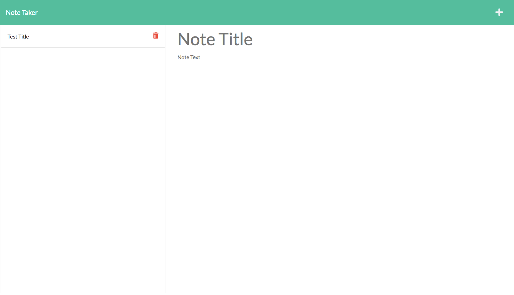

# Note-TakerExp

## Description
- Note-takerexp is an application that is used to create, save and delete notes. When you get to the landing page there is a button that says Get Started, when you click on it it will take you to the notes page. There are two sections, a note title and note text where you can input your notes. 
- Once you write in the note title and note text, a save button will pop out on the right corner of the page, when you click it, the note will be saved.
- Once saved, it will show up on the left side of the page with a red trashcan icon.
- When you click on the red icon, it will delete the note. 

## Screenshot

## Links
GitHub Link: https://github.com/MaSaLo13/note-takerexp

Heroku Link: https://guarded-gorge-65781.herokuapp.com/

